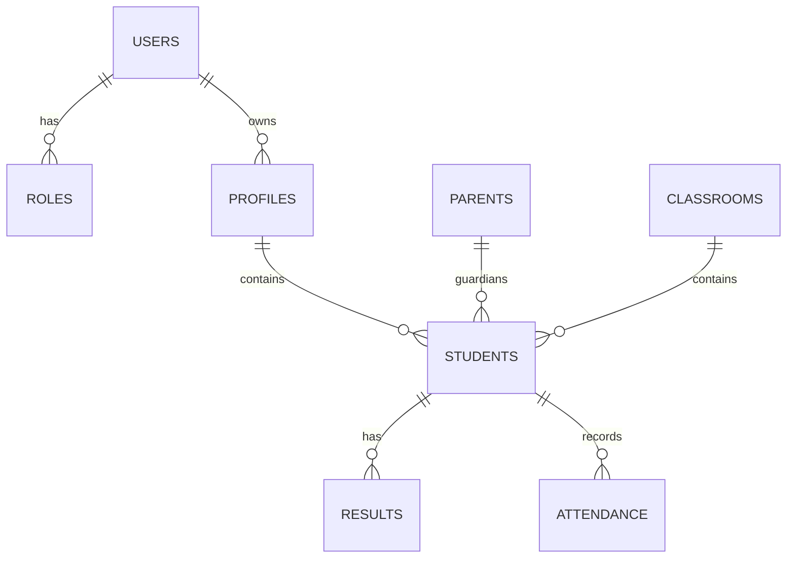

**Overview**
- Purpose: Reference describing the SMS application architecture, data model, runtime flows, where to change behavior, and how to seed/demo locally.
- Audience: Developers working on features, seeding, RBAC, and debugging.

**Project layout (key folders/files)**
- `src/` — application source.
  - `src/components/` — reusable UI components.
  - `src/pages/` — route pages and views.
  - `src/services/` — API layer and Firebase client config. See [src/services/api.js](src/services/api.js#L1) and [src/services/firebaseConfig.js](src/services/firebaseConfig.js#L1).
  - `src/config/` — RBAC and permission maps (see [src/config/rbac.js](src/config/rbac.js#L1) and [src/config/permissions.js](src/config/permissions.js#L1)).
  - `src/contexts/` — React contexts for auth, settings, and toasts.
  - `src/hooks/` — small reusable hooks (debounce, currency, etc.).
- `seedData.mjs` — admin seeding utility used to populate demo data (roles, users, profiles, links).
- `serviceAccountKey.json` — optional local file (ignored by VCS) containing a Firebase admin service account for seeding.
- `package.json` — scripts and dependencies; includes `seed` script when present.
- `dist/` — build output (do not edit).

**High-level architecture**
- Frontend: React + Vite single-page app. Authentication handled by Firebase client SDK; app state via React Contexts.
- Data: Firestore collections store domain objects. Client SDK reads/writes; `firebase-admin` is used only for seeding and admin scripts.
- API abstraction: `src/services/api.js` implements a thin abstraction over Firestore operations and provides some environment-friendly pseudo-endpoints (e.g., `admin` or `head-teacher` prefixed routes used by the app to group admin behaviors).

**Runtime flows**
- Auth flow: User signs in via Firebase auth (client). `AuthContext` wraps the app and exposes `currentUser` and `profile`.
- Data access: Components call `api.js` helpers (listDocuments, getDocument, upsertDocument) which normalize collection access and query construction.
- RBAC: Components and pages import `ROLES` from `src/config/rbac.js` and use permission maps from `src/config/permissions.js` to show/hide UI and conditionally enable actions.

**Data model (collections & fields)**
Below is a concise model focusing on core collections used by the app. Treat field lists as canonical for seed/demo purposes — the production schema may vary.

- `roles`
  - `_id` (string): doc id (e.g., `role_admin`)
  - `name` (string): human label (e.g., `Admin`)
  - `key` (string): role key used in code (e.g., `admin`)
  - `permissions` (array[string]): optional capability keys.

- `users`
  - `_id` (string): unique id (used in app as user._id)
  - `email` (string)
  - `name` (string)
  - `role` (string): role key (e.g., `teacher`)
  - `createdAt` (timestamp)

- `profiles` (optional umbrella) / `students` / `parents` / `teachers`
  - `_id` (string)
  - `userId` (string): link to `users._id`
  - `studentId` / `parentId` (string): domain ids used for cross-linking
  - domain fields: `classroomId`, `dob`, `admissionNo`, `address`, etc.

- `results`
  - `_id`, `studentId`, `subjectId`, `examId`, `grades`, `status` (draft|submitted|approved)

- `attendance`
  - `_id`, `studentId`, `date`, `status` (present|absent|late), `recordedBy`

- `homework`
  - `_id`, `classroomId`, `subjectId`, `assignedBy`, `dueDate`, `description`

These collections interlink; the seed script creates example documents and links parents ↔ students via `parentId` / `studentId` fields.

**Sample documents**
users/user:
```
{
  _id: 'u_admin_1',
  email: 'admin@esyncsms.com',
  name: 'System Admin',
  role: 'admin',
  createdAt: 1680000000000
}
```

student:
```
{
  _id: 's_100',
  userId: 'u_student_100',
  admissionNo: 'ADM100',
  classroomId: 'class_1'
}
```

parent:
```
{
  _id: 'p_200',
  userId: 'u_parent_200',
  children: ['s_100']
}
```

**Entity Relationship (simple)**


**Seeding flow (what `seedData.mjs` does)**
1. Load service account credentials from `serviceAccountKey.json` or `GOOGLE_APPLICATION_CREDENTIALS`.
2. Initialize `firebase-admin` and get a Firestore client.
3. Create `roles` documents (idempotent upserts).
4. Create `users` for admin, head-teacher, teachers, parents, and students using `@esyncsms.com` test domain.
5. Create domain documents (`students`, `parents`, `profiles`) and link using `userId`, `studentId`, `parentId`.
6. Report a summary of created/updated documents on completion.

**Seeding: common commands**
```bash
# syntax check
node --check seedData.mjs

# run seed (requires admin credentials)
node seedData.mjs

# using emulator (optional)
export FIRESTORE_EMULATOR_HOST=localhost:8080
node seedData.mjs
```

**RBAC integration points**
- Constants in `src/config/rbac.js` are the canonical role keys.
- Permission maps in `src/config/permissions.js` provide higher-level capabilities that UI may consume.
- Search for role checks in the codebase and replace literal strings with `ROLES.*` imports.

**Where to change behavior**
- Change roles and permissions: `src/config/rbac.js`, `src/config/permissions.js`.
- Change API behavior and collection lists: `src/services/api.js`.
- Change seed data: `seedData.mjs`.

**Developer tips**
- Keep the `@esyncsms.com` domain consistent between `seedData.mjs` and UI placeholders.
- Use the Firestore emulator for safe testing: it prevents accidental writes to production.
- Prefer idempotent operations in `seedData.mjs` when re-running seeds.

**Troubleshooting quick hits**
- `TypeError` when linking → check array indices and mapping logic in `seedData.mjs`.
- Permission denied → validate `serviceAccountKey.json` and `project_id`.
- Stale UI after edits → rebuild and redeploy: `npm run build` then redeploy.

---
Generated 2026-07-09.